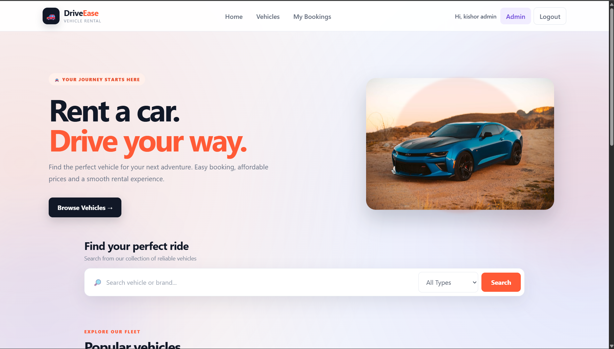
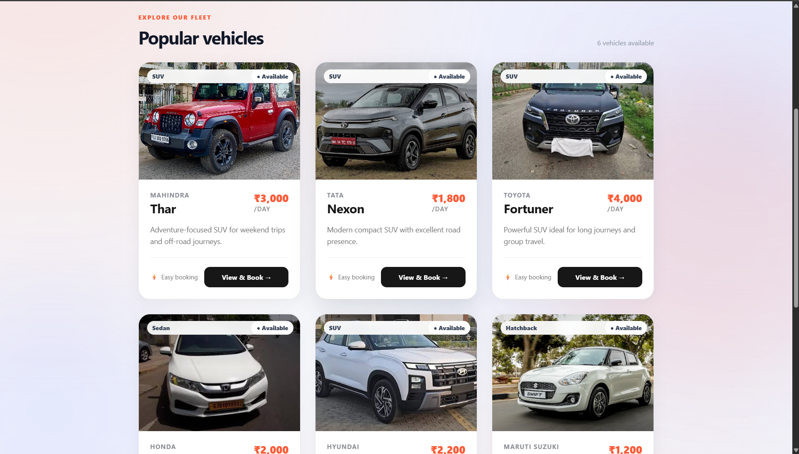
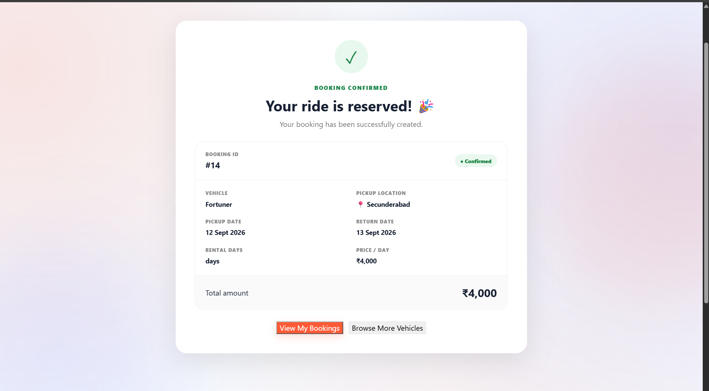
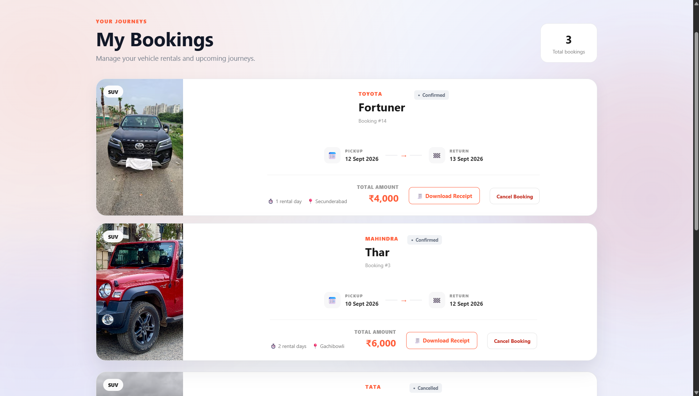
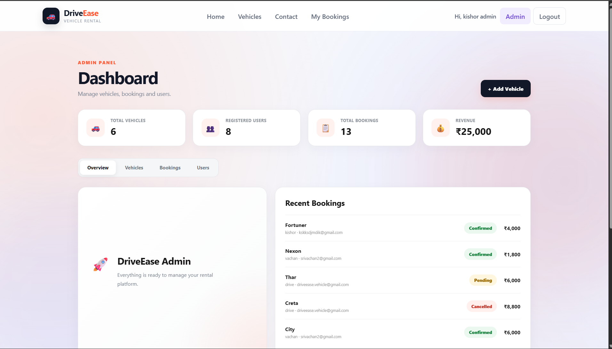

# 🚗 DriveEase — Vehicle Rental System

DriveEase is a full-stack vehicle rental web application that allows users to browse vehicles, search and filter the available fleet, create rental bookings, and manage their bookings.

Administrators can manage vehicles, view registered users, monitor bookings, update booking statuses, and track rental revenue through an admin dashboard.

---

## ✨ Features

### 👤 User Features

- User registration and login
- JWT-based authentication
- Browse available vehicles
- Search vehicles by name or brand
- Filter vehicles by type
- View vehicle details
- Select pickup and return dates
- Automatic rental-day calculation
- Automatic price calculation
- Booking confirmation
- View personal bookings
- Cancel active bookings

### 👑 Admin Features

- Admin authentication
- Admin dashboard
- View total vehicles
- View registered users
- View total bookings
- View rental revenue
- Add vehicles
- Edit vehicles
- Delete vehicles
- Enable/disable vehicle availability
- View all customer bookings
- Update booking status
- View registered users

### 🔐 Security

- JWT authentication
- Password hashing with bcrypt
- Protected user routes
- Protected admin routes
- Role-based authorization
- Server-side booking validation

---

## 🛠️ Tech Stack

### Frontend

- React.js
- Vite
- HTML
- CSS
- JavaScript

### Backend

- Node.js
- Express.js
- REST APIs

### Database

- MySQL
- XAMPP / MariaDB

### Authentication

- JSON Web Tokens (JWT)
- bcryptjs

---

## 🏗️ Project Structure

```text
Vehicle-Rental/
│
├── frontend/
│   ├── src/
│   │   ├── assets/
│   │   │   └── hero.png
│   │   ├── App.jsx
│   │   ├── App.css
│   │   ├── index.css
│   │   └── main.jsx
│   │
│   ├── package.json
│   └── ...
│
├── backend/
│   ├── middleware/
│   │   └── authMiddleware.js
│   │
│   ├── routes/
│   │   ├── authRoutes.js
│   │   ├── vehicleRoutes.js
│   │   ├── bookingRoutes.js
│   │   └── adminRoutes.js
│   │
│   ├── db.js
│   ├── server.js
│   ├── .env
│   └── package.json
│
├── screenshots/
│   ├── home.png
│   ├── vehicles.png
│   ├── booking.png
│   ├── my-bookings.png
│   └── admin.png
│
└── README.md
```

---

## 📸 Screenshots

### 🏠 Home



### 🚗 Vehicle Fleet



### 📅 Booking



### 📋 My Bookings



### 👑 Admin Dashboard


